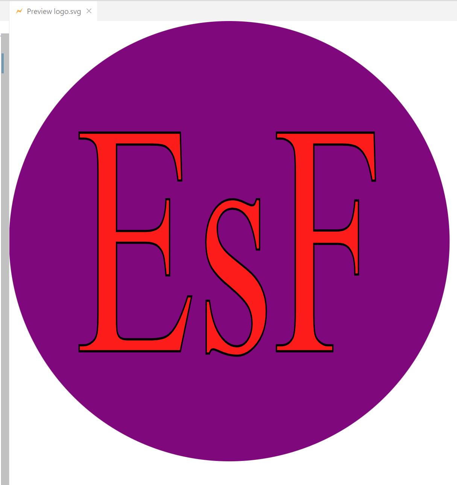

# SVG-Logo-Making


  ## Table of Content
  - [Description](#description)
  - [Technology Used](#technology)
  - [Installation](#installation)
  - [Usage](#usage)
  - [Credits](#credits)
  - [Tests](#tests)
  - [License](#license)
  - [Questions](#questions)

  ## Description
  It generates the professional svg logo according to User's requirements in size 300x200 pixel image.
  ## Technology Used
  - JavaScript, 
  - NodeJS, 
  - Inquirer v8.2.4, 
  - SVG
  ## Installation
  Open terminal and type  
  ``` 
  node index.js
  ```
  ## Usage 
  Answer the questions and get the result!
  https://watch.screencastify.com/v/xFU3vLEVIfjcDk8alCj1  

  The example below was get for:
  - shape: circle;
  - color:   purple;
  - text: EsF
  - font: Times New Roman;
  - text color: red;

  <p align="left">
  


  ## Credits
  - Mozilla.org
  - Jacob Jenkov https://www.youtube.com/@JakobJenkov

  ## Tests
  The folder ./tests/ contains file shapes.test.js , where we can test output for svg elements code.
  ## License
  The project does not have a License
 
  ## Questions
  If you have any questions regarding the project, please, feel free to contact me:
  - GitHub: [elenafwork](https://github/elenafwork)
  - Email: <elenaf.work@gmail.com>


